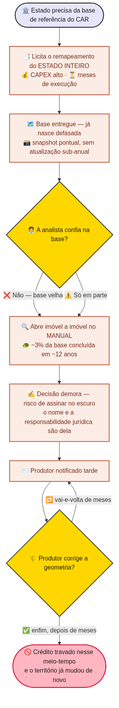
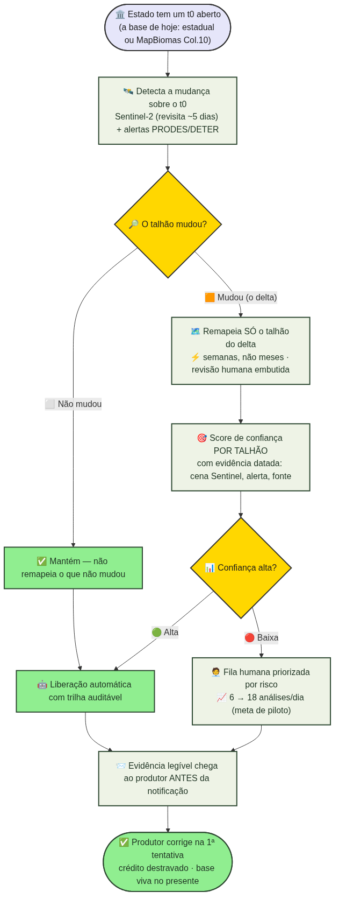
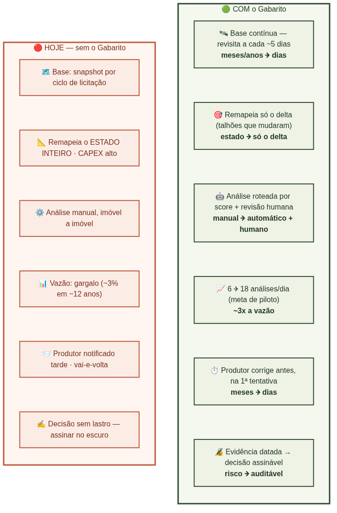

# Fluxos do processo — Gabarito (CAR · Desafio 02)

Fonte `.mmd` (Mermaid) + PNG renderizado. Online: **https://gabarito.pages.dev/fluxos**

> **Legenda** — **t0**: a base de referência de hoje (o mapa-resposta usado pra conferir cada CAR). **delta**: só o que mudou no território desde o t0 (os talhões a remapear).

## 1. Como é hoje — sem o Gabarito


## 2. Como fica — com o Gabarito


## 3. As diferenças, lado a lado


---
Re-renderizar após editar um `.mmd`:
```bash
npx -y @mermaid-js/mermaid-cli -i diagrams/fluxo_01_atual.mmd -o diagrams/fluxo_01_atual.png -b white
```
